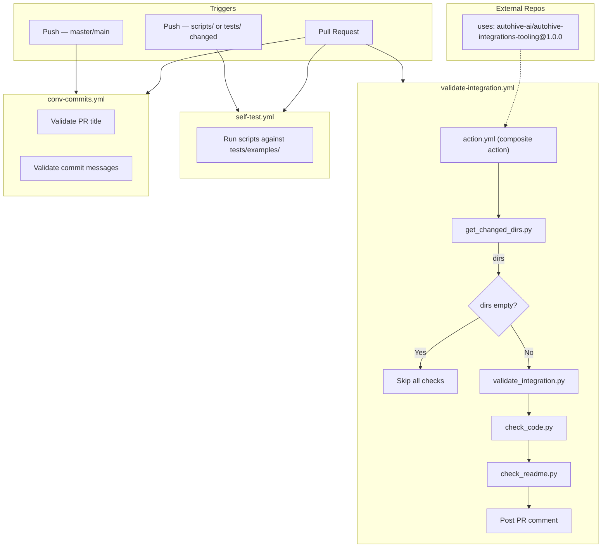

# Autohive Integrations Tooling

Validation tools and CI/CD workflows for Autohive integrations.

> 📖 **Building an integration?** See the [SDK documentation](https://github.com/autohive-ai/integrations-sdk/tree/master/docs/manual) for the tutorial, structure reference, and patterns.

**Requires: Python 3.13+**

## What's Included

| File | Description |
|------|-------------|
| `action.yml` | Composite GitHub Action for cross-repo integration validation ([usage](#usage-as-github-action)) |
| `scripts/validate_integration.py` | Structure and config validation ([docs](scripts/docs/validate_integration.md)) |
| `scripts/check_code.py` | Syntax, import, JSON, lint, format, security, dependency, and config sync checks ([docs](scripts/docs/check_code.md)) |
| `scripts/check_imports.py` | Import availability checker ([docs](scripts/docs/check_imports.md)) |
| `scripts/check_readme.py` | README update verification ([docs](scripts/docs/check_readme.md)) |
| `scripts/check_config_sync.py` | Config-code sync checker ([docs](scripts/docs/check_config_sync.md)) |
| `scripts/get_changed_dirs.py` | Changed directory detection ([docs](scripts/docs/get_changed_dirs.md)) |
| `.github/workflows/validate-integration.yml` | PR validation pipeline |
| `.github/workflows/self-test.yml` | Regression guard for tooling scripts |
| `.github/workflows/conv-commits.yml` | Conventional commit enforcement |
| `requirements-dev.txt` | Dev tool dependencies (ruff, bandit, pip-audit) |
| `ruff.toml` | Ruff linter and formatter configuration |
| `CONTRIBUTING.md` | Contributor guide |
| `LOCAL_DEVELOPMENT.md` | Local development workflow and documentation map |
| `INTEGRATION_CHECKLIST.md` | Manual review checklist |
| `tests/examples/` | Test fixtures for validation scripts |

## CI Pipeline



**What each step checks:**

| Step | Script | Checks |
|------|--------|--------|
| Detect changes | `get_changed_dirs.py` | `git diff` → extract top-level dirs, filter out `.github`, `scripts`, `tests` |
| Structure check | `validate_integration.py` | Folder name, required files, config.json schema, `__init__.py`, requirements.txt, tests/, icon size, unused scopes |
| Code check | `check_code.py` | pip install, py_compile, check_imports, JSON validity, ruff check, ruff format, bandit, pip-audit, check_config_sync |
| README check | `check_readme.py` | New integration files added → was README.md also updated? |

## Usage as GitHub Action

This repository provides a composite GitHub Action that other repos can use to validate integrations.

### Basic usage

```yaml
name: Validate Integration

on:
  pull_request:
    branches: [master, main]

jobs:
  validate:
    runs-on: ubuntu-latest
    permissions:
      contents: read
      pull-requests: write
    steps:
      - uses: actions/checkout@v4
        with:
          fetch-depth: 0

      - uses: autohive-ai/autohive-integrations-tooling@1.0.0
        with:
          base_ref: origin/${{ github.base_ref }}
```

### Inputs

| Input | Required | Default | Description |
|-------|----------|---------|-------------|
| `base_ref` | No* | — | Git ref to diff against for detecting changed directories |
| `directories` | No* | — | Space-separated list of directories to validate (skips auto-detection) |
| `python_version` | No | `3.13` | Python version to use |
| `post_comment` | No | `true` | Post a sticky PR comment with results |

\* Either `base_ref` or `directories` must be provided.

### Outputs

| Output | Description |
|--------|-------------|
| `directories` | Space-separated list of validated directories |
| `structure_result` | `success` or `failure` |
| `code_result` | `success` or `failure` |
| `readme_result` | `success` or `failure` |
| `structure_output` | Full output of the structure check |
| `code_output` | Full output of the code check |
| `readme_output` | Full output of the README check |

### PR Comment

When `post_comment` is enabled, the action posts a sticky comment on the PR with a summary table showing ✅ Passed, ⚠️ Passed with warnings, or ❌ Failed for each check, along with expandable full output.

## Versioning

The **major** version of this tooling matches the [Autohive Integrations SDK](https://github.com/autohive-ai/integrations-sdk) major version it targets. The **minor** and **patch** versions are the tooling's own iteration and do _not_ correspond to SDK releases.

For example, `2.1.0` means "the second tooling release for SDK v2" — it does not imply an SDK `2.1.0` exists.

| Tooling version | Meaning |
|-----------------|---------|
| `2.0.0` | Initial tooling release for SDK v2 |
| `2.1.0` | New checks or features (still SDK v2) |
| `2.1.1` | Bug-fix to the tooling (still SDK v2) |
| `3.0.0` | Tooling targeting SDK v3 |

## Setup

```bash
uv python install 3.13
uv venv --python 3.13
source .venv/bin/activate   # Linux/macOS
# .venv\Scripts\activate    # Windows
uv pip install -r requirements-dev.txt
```

## Local Testing

```bash
# Validate structure and config
python scripts/validate_integration.py my-integration

# Run code quality checks (syntax, imports, JSON, lint, format, security, deps, config sync)
python scripts/check_code.py my-integration

# Check all imports in a file
python scripts/check_imports.py my-integration/main.py

# Validate all integrations (auto-discovers at repo root)
python scripts/validate_integration.py
```

## Integration Requirements

See `INTEGRATION_CHECKLIST.md` for full details.

### Required Files
- `config.json` - Integration configuration
- `{name}.py` - Main implementation
- `__init__.py` - Package init (minimal, optional for modular integrations with `actions/`)
- `requirements.txt` - Dependencies (must include `autohive-integrations-sdk`)
- `README.md` - Documentation
- `icon.png` or `icon.svg` - Integration icon (512x512 pixels)
- `tests/` - Test folder with `__init__.py`, `context.py`, and `test_*.py`

## Integrations

<!-- Add your integration here when submitting a PR -->
| Integration | Description | Auth Type |
|-------------|-------------|-----------|
