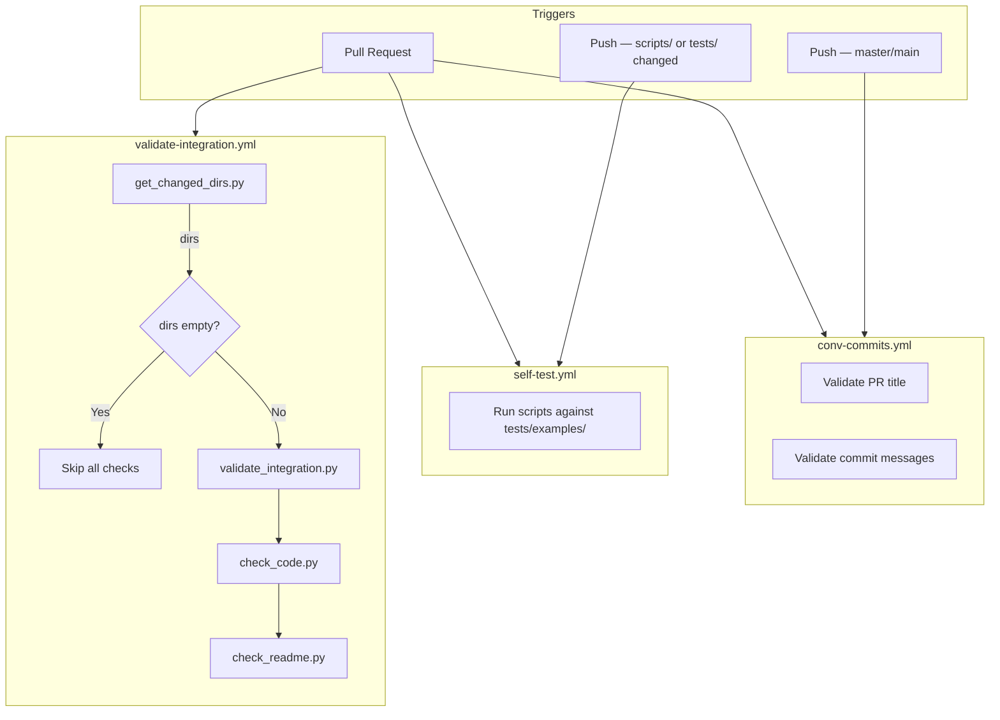

# Autohive Integrations Tooling

Validation tools and CI/CD workflows for Autohive integrations.

**Requires: Python 3.13+**

## What's Included

| File | Description |
|------|-------------|
| `scripts/validate_integration.py` | Structure and config validation ([docs](scripts/docs/validate_integration.md)) |
| `scripts/check_code.py` | Syntax, import, JSON, lint, format, security, dependency, and config sync checks ([docs](scripts/docs/check_code.md)) |
| `scripts/check_imports.py` | Import availability checker ([docs](scripts/docs/check_imports.md)) |
| `scripts/check_readme.py` | README update verification ([docs](scripts/docs/check_readme.md)) |
| `scripts/check_config_sync.py` | Config-code sync checker ([docs](scripts/docs/check_config_sync.md)) |
| `scripts/get_changed_dirs.py` | Changed directory detection ([docs](scripts/docs/get_changed_dirs.md)) |
| `.github/workflows/validate-integration.yml` | PR validation pipeline |
| `.github/workflows/self-test.yml` | Regression guard for tooling scripts |
| `.github/workflows/conv-commits.yml` | Conventional commit enforcement |
| `requirements-dev.txt` | Dev tool dependencies (ruff, bandit, pip-audit) |
| `ruff.toml` | Ruff linter and formatter configuration |
| `CONTRIBUTING.md` | Contributor guide |
| `LOCAL_DEVELOPMENT.md` | Local development workflow and documentation map |
| `INTEGRATION_CHECKLIST.md` | Manual review checklist |
| `tests/examples/` | Test fixtures for validation scripts |

## CI Pipeline



**What each step checks:**

| Step | Script | Checks |
|------|--------|--------|
| Detect changes | `get_changed_dirs.py` | `git diff` → extract top-level dirs, filter out `.github`, `scripts`, `tests` |
| Structure check | `validate_integration.py` | Folder name, required files, config.json schema, `__init__.py`, requirements.txt, tests/, icon size, unused scopes |
| Code check | `check_code.py` | pip install, py_compile, check_imports, JSON validity, ruff check, ruff format, bandit, pip-audit, check_config_sync |
| README check | `check_readme.py` | New integration files added → was README.md also updated? |

## Setup

```bash
uv python install 3.13
uv venv --python 3.13
source .venv/bin/activate   # Linux/macOS
# .venv\Scripts\activate    # Windows
uv pip install -r requirements-dev.txt
```

## Local Testing

```bash
# Validate structure and config
python scripts/validate_integration.py my-integration

# Run code quality checks (syntax, imports, JSON, lint, format, security, deps, config sync)
python scripts/check_code.py my-integration

# Check all imports in a file
python scripts/check_imports.py my-integration/main.py

# Validate all integrations (auto-discovers at repo root)
python scripts/validate_integration.py
```

## Integration Requirements

See `INTEGRATION_CHECKLIST.md` for full details.

### Required Files
- `config.json` - Integration configuration
- `{name}.py` - Main implementation
- `__init__.py` - Package init (minimal)
- `requirements.txt` - Dependencies (must include `autohive-integrations-sdk`)
- `README.md` - Documentation
- `icon.png` or `icon.svg` - Integration icon (512x512 pixels)
- `tests/` - Test folder with `__init__.py`, `context.py`, and `test_*.py`

## Integrations

<!-- Add your integration here when submitting a PR -->
| Integration | Description | Auth Type |
|-------------|-------------|-----------|
| [slack](slack/) | Send messages and manage channels in Slack | Bot Token (`xoxb-`) |
|-------------|-------------|-----------|
