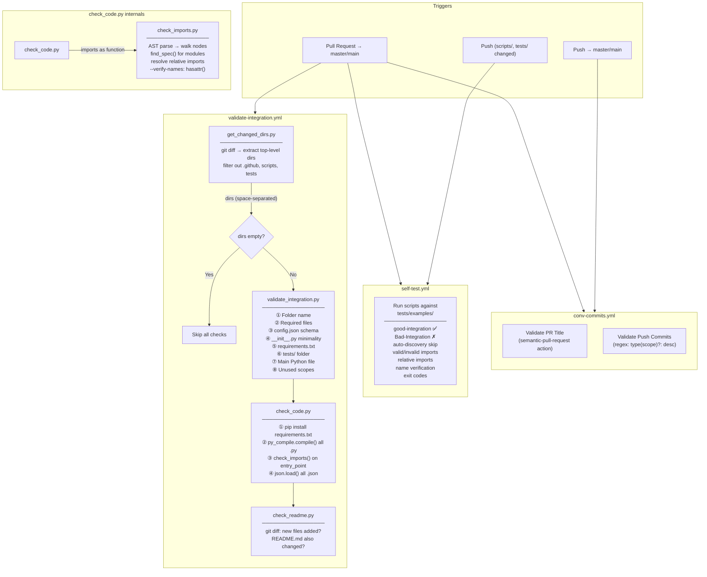

# Autohive Integrations Tooling

Validation tools and CI/CD workflows for Autohive integrations.

**Requires: Python 3.13+**

## What's Included

| File | Description |
|------|-------------|
| `scripts/validate_integration.py` | Structure and config validation ([docs](scripts/docs/validate_integration.md)) |
| `scripts/check_code.py` | Syntax, import, and JSON checks ([docs](scripts/docs/check_code.md)) |
| `scripts/check_imports.py` | Import availability checker ([docs](scripts/docs/check_imports.md)) |
| `scripts/check_readme.py` | README update verification ([docs](scripts/docs/check_readme.md)) |
| `scripts/get_changed_dirs.py` | Changed directory detection ([docs](scripts/docs/get_changed_dirs.md)) |
| `.github/workflows/validate-integration.yml` | PR validation pipeline |
| `.github/workflows/self-test.yml` | Regression guard for tooling scripts |
| `.github/workflows/conv-commits.yml` | Conventional commit enforcement |
| `INTEGRATION_CHECKLIST.md` | Manual review checklist |
| `tests/examples/` | Test fixtures for validation scripts |

## CI Pipeline



## Local Testing

```bash
# Validate structure and config
python scripts/validate_integration.py my-integration

# Run code quality checks (syntax, imports, JSON)
python scripts/check_code.py my-integration

# Check all imports in a file
python scripts/check_imports.py my-integration/main.py

# Validate all integrations (auto-discovers at repo root)
python scripts/validate_integration.py
```

## Integration Requirements

See `INTEGRATION_CHECKLIST.md` for full details.

### Required Files
- `config.json` - Integration configuration
- `{name}.py` - Main implementation
- `__init__.py` - Package init (minimal)
- `requirements.txt` - Dependencies (must include `autohive-integrations-sdk`)
- `README.md` - Documentation
- `icon.png` or `icon.svg` - Integration icon
- `tests/` - Test folder with `__init__.py`, `context.py`, and `test_*.py`

## Integrations

| Integration | Description | Auth Type |
|-------------|-------------|-----------|
| good-integration | Example valid integration | Custom |
| sample-api | Sample API integration for testing | Custom |
