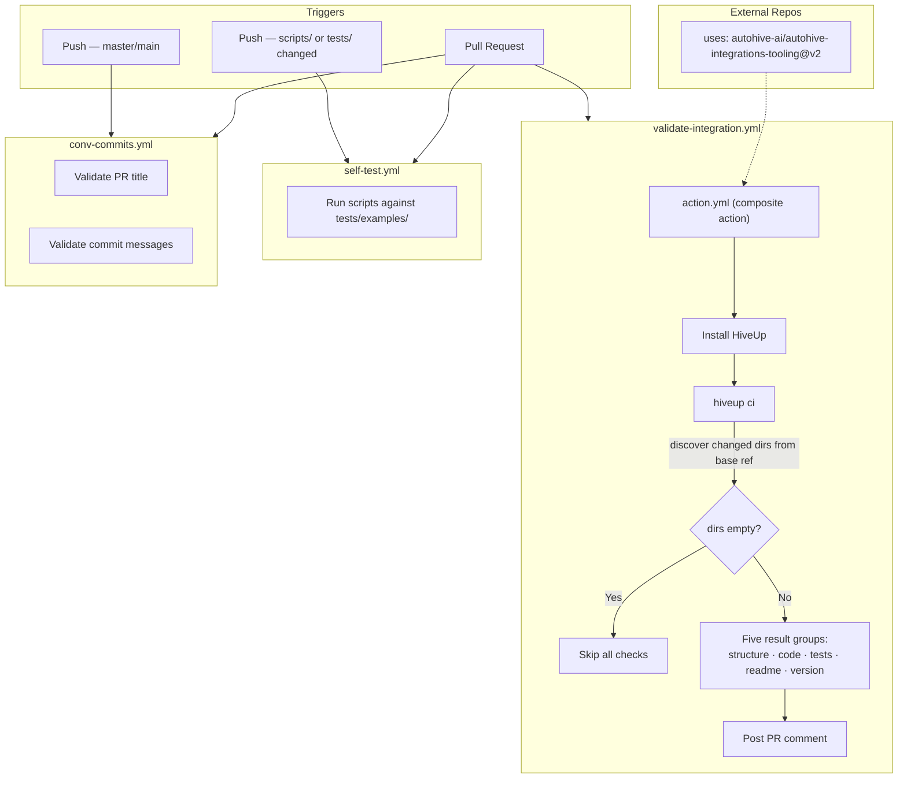

# Autohive Integrations Tooling

Validation tools and CI/CD workflows for Autohive integrations.

> 📖 **Building an integration?** See the [SDK documentation](https://github.com/autohive-ai/integrations-sdk/tree/master/docs/manual) for the tutorial, structure reference, and patterns.

**Requires: Python 3.13+**

## What's Included

| File | Description |
|------|-------------|
| `action.yml` | Composite GitHub Action for cross-repo integration validation ([usage](#usage-as-github-action)) |
| `scripts/validate_integration.py` | Structure and config validation ([docs](scripts/docs/validate_integration.md)) |
| `scripts/check_code.py` | Syntax, import, JSON, lint, format, security, dependency, and config sync checks ([docs](scripts/docs/check_code.md)) |
| `scripts/check_imports.py` | Import availability checker ([docs](scripts/docs/check_imports.md)) |
| `scripts/check_readme.py` | README update verification ([docs](scripts/docs/check_readme.md)) |
| `scripts/check_version_bump.py` | Version bump verification with bump-level recommendations ([docs](scripts/docs/check_version_bump.md)) |
| `scripts/check_config_sync.py` | Config-code sync checker ([docs](scripts/docs/check_config_sync.md)) |
| `scripts/run_tests.py` | Unit test runner with coverage ([docs](scripts/docs/run_tests.md)) |
| `scripts/get_changed_dirs.py` | Changed directory detection ([docs](scripts/docs/get_changed_dirs.md)) |
| `.github/workflows/validate-integration.yml` | PR validation pipeline |
| `.github/workflows/self-test.yml` | Regression guard for tooling scripts |
| `.github/workflows/conv-commits.yml` | Conventional commit enforcement |
| `requirements-dev.txt` | Dev tool dependencies (ruff, bandit, pip-audit, pytest, pytest-asyncio, pytest-cov) |
| `ruff.toml` | Ruff linter and formatter configuration |
| `CONTRIBUTING.md` | Contributor guide |
| `LOCAL_DEVELOPMENT.md` | Local development workflow and documentation map |
| `INTEGRATION_CHECKLIST.md` | Manual review checklist |
| `tests/examples/` | Test fixtures for validation scripts |

## CI Pipeline


```mermaid
flowchart TB
    subgraph triggers["Triggers"]
        PR["Pull Request"]
        PUSH_SCRIPTS["Push — scripts/ or tests/ changed"]
        PUSH_MAIN["Push — master/main"]
    end

    subgraph wf1["validate-integration.yml"]
        ACTION["action.yml (composite action)"]
        ACTION --> INSTALL["Install HiveUp"]
        INSTALL --> CI["hiveup ci"]
        CI -->|discover changed dirs from base ref| COND{dirs empty?}
        COND -->|Yes| SKIP[Skip all checks]
        COND -->|No| GROUPS["Five result groups:<br/>structure · code · tests · readme · version"]
        GROUPS --> CMT_POST[Post PR comment]
    end

    subgraph wf2["self-test.yml"]
        ST[Run scripts against tests/examples/]
    end

    subgraph wf3["conv-commits.yml"]
        PRT[Validate PR title]
        CMT[Validate commit messages]
    end

    subgraph external["External Repos"]
        EXT["uses: autohive-ai/autohive-integrations-tooling@v2"]
    end

    PR --> wf1
    PR --> wf2
    PR --> wf3
    PUSH_SCRIPTS --> wf2
    PUSH_MAIN --> wf3
    EXT -.-> ACTION
```

**What each HiveUp result group owns:**

| Result group | HiveUp checks | Checks |
|--------------|---------------|--------|
| Structure | `structure` | Folder name, required files, config.json schema, `__init__.py`, requirements.txt, tests/, icon size, unused scopes ([legacy script details](scripts/docs/validate_integration.md)) |
| Code | `syntax`, `imports`, `json`, `lint`, `format`, `security`, `audit`, `sync`, `fetch` | Isolated dependency and import validation, compilation, JSON validity, Ruff, Bandit, pip-audit, config sync, and fetch-response patterns ([legacy code-check details](scripts/docs/check_code.md)) |
| Tests | `tests` | Runs each integration's `test_*_unit.py` files with pytest and isolated dependencies; warns if none exist ([legacy runner details](scripts/docs/run_tests.md)) |
| README | `readme` | For a new integration, checks that the repository README was updated ([legacy check details](scripts/docs/check_readme.md)) |
| Version | `version` | Checks that config.json version increased and recommends a bump level ([legacy check details](scripts/docs/check_version_bump.md)) |

When directories are not supplied, `hiveup ci` discovers changed integration directories from `base_ref`; the legacy discovery behavior is documented [here](scripts/docs/get_changed_dirs.md).

## Usage as GitHub Action

This repository provides a composite GitHub Action that other repos can use to validate integrations.

### Basic usage

```yaml
name: Validate Integration

on:
  pull_request:
    branches: [master, main]

jobs:
  validate:
    runs-on: ubuntu-latest
    permissions:
      contents: read
      pull-requests: write
    steps:
      - uses: actions/checkout@v4
        with:
          fetch-depth: 0

      - uses: autohive-ai/autohive-integrations-tooling@v2
        with:
          base_ref: origin/${{ github.base_ref }}
```

### Inputs

| Input | Required | Default | Description |
|-------|----------|---------|-------------|
| `base_ref` | No* | — | Git ref to diff against for detecting changed directories |
| `directories` | No* | — | Space-separated list of directories to validate (skips auto-detection) |
| `python_version` | No | `3.13` | Python version to use |
| `post_comment` | No | `true` | Post a sticky PR comment with results |
| `comment_header` | No | `validation-results` | Header used to identify the sticky PR comment |

\* Either `base_ref` or `directories` must be provided.

### Outputs

| Output | Description |
|--------|-------------|
| `directories` | Space-separated list of validated directories |
| `structure_result` | `success`, `failure`, or `skipped` |
| `code_result` | `success`, `failure`, or `skipped` |
| `tests_result` | `success`, `failure`, or `skipped` |
| `readme_result` | `success`, `failure`, or `skipped` |
| `version_result` | `success`, `failure`, or `skipped` |
| `structure_output` | Full output of the structure check |
| `code_output` | Full output of the code check |
| `tests_output` | Full output of the test runner |
| `readme_output` | Full output of the README check |
| `version_output` | Full output of the version check |
| `comment_path` | Path to the rendered Markdown PR comment body, useful for fork-safe comment posting from a separate workflow |

### PR Comment

When `post_comment` is enabled, the action posts a sticky comment on the PR with a summary table showing ✅ Passed, ⚠️ Passed with warnings, or ❌ Failed for each check, along with expandable full output.

## Versioning

The **major** version of this tooling matches the [Autohive Integrations SDK](https://github.com/autohive-ai/integrations-sdk) major version it targets. The **minor** and **patch** versions are the tooling's own iteration and do _not_ correspond to SDK releases.

For example, `2.1.0` means "the second tooling release for SDK v2" — it does not imply an SDK `2.1.0` exists.

| Tooling version | Meaning |
|-----------------|---------|
| `2.0.0` | Initial tooling release for SDK v2 |
| `2.1.0` | New checks or features (still SDK v2) |
| `2.1.1` | Bug-fix to the tooling (still SDK v2) |
| `2.4.0a1` | First Python HiveUp rewrite prerelease after tooling `2.3.0` |
| `3.0.0` | Tooling targeting SDK v3 |

The Python distribution, import package, and executable are all named `hiveup`.
`src/hiveup/__init__.py` is the single package-version source; build metadata
reads the version from there.

## Install HiveUp from a local build

HiveUp is currently distributed as a local prerelease build. It is **not
published to PyPI**. PyPI Trusted Publishing is deferred to
[issue #50](https://github.com/Autohive-AI/autohive-integrations-tooling/issues/50).

Build the wheel and source distribution:

```bash
git clone https://github.com/Autohive-AI/autohive-integrations-tooling.git
cd autohive-integrations-tooling

uv python install 3.13
uv venv --python 3.13
source .venv/bin/activate   # Linux/macOS
# .venv\Scripts\activate    # Windows
uv pip install -r requirements-dev.txt
python -m build
python -m twine check dist/*
```

Install the resulting wheel as an isolated command-line tool:

```bash
uv tool install --force ./dist/hiveup-2.4.0a1-py3-none-any.whl
hiveup --version
```

`pipx` is also supported:

```bash
pipx install --force ./dist/hiveup-2.4.0a1-py3-none-any.whl
```

Rebuild and repeat the `--force` installation to upgrade a local prerelease.
To remove it:

```bash
uv tool uninstall hiveup
# or: pipx uninstall hiveup
```

Pull-request CI builds both `hiveup-2.4.0a1-py3-none-any.whl` and
`hiveup-2.4.0a1.tar.gz`, verifies their metadata, installs the wheel outside the
source checkout, exercises the supported CLI lifecycle, and uploads them as a
GitHub Actions artifact. It does not publish either file.

### Compatibility

| Component | Supported contract |
|-----------|--------------------|
| Python running HiveUp | Python 3.13+ |
| Integration SDK | SDK 2.x (`autohive-integrations-sdk~=2.0`) |
| Deployment dependencies | CPython 3.13 wheels for `manylinux2014_x86_64` |
| Integration icons | PNG, JPG, or JPEG; exactly 512×512 |
| Integration entry point | Root-level `.py` file with `<module> = Integration.load(...)` |
| Reserved runtime file | `main.py` may not be an integration entry point |

### Migrating from the .NET HiveUp tool

The Python rewrite preserves the established command name and parity surface:

| .NET command | Python command |
|--------------|----------------|
| `hiveup create` | `hiveup create` |
| `hiveup init` | `hiveup init` |
| `hiveup validate` | `hiveup validate` |
| `hiveup auth` | `hiveup auth` |
| `hiveup package` | `hiveup package` |
| `hiveup list-templates` | Removed; the Python rewrite currently has one SDK-aligned scaffold |

The Python CLI also provides focused `check`, isolated `test`, CI, and `doctor`
commands. Local action execution is not part of .NET parity and is tracked in
[issue #49](https://github.com/Autohive-AI/autohive-integrations-tooling/issues/49).

After installing the local wheel, the old global .NET tool can be removed when
the developer is ready:

```bash
dotnet tool uninstall --global Autohive.Integrations.Cli
```

Legacy validation entry points under `scripts/` remain available as compatibility
paths, but new local workflows should use `hiveup validate`, `hiveup check`, and
`hiveup test` directly.

## Repository development setup

```bash
uv python install 3.13
uv venv --python 3.13
source .venv/bin/activate   # Linux/macOS
# .venv\Scripts\activate    # Windows
uv pip install -r requirements-dev.txt
uv pip install -e .
```

## HiveUp scaffolding (prerelease)

Create a public integration, or initialize the current directory:

```bash
hiveup create my-integration
mkdir my-integration && cd my-integration
hiveup init --name "My Integration"
```

Custom auth generates an editable API-key starter schema. Platform auth requires an explicit provider; scopes are optional:

```bash
hiveup create my-integration --auth-type custom
hiveup create my-integration \
  --auth-type platform \
  --auth-provider github \
  --auth-scopes repo,read:user
```

Authentication edits are always explicit. Existing compatible custom schemas and platform metadata are preserved:

```bash
hiveup auth my-integration --auth-type custom
hiveup auth my-integration --auth-type platform --auth-provider github --auth-scopes repo
hiveup auth my-integration --auth-type none
```

`create` and `init` refuse non-empty directories by default. `--force` atomically replaces only scaffold-owned files and preserves other developer files.

## Local Testing

```bash
# Validate structure and config
hiveup check structure my-integration

# Run code quality checks (syntax, imports, JSON, lint, format, security, deps, config sync, fetch pattern)
hiveup validate my-integration

# Machine-readable output, or apply supported Ruff lint/format fixes
hiveup validate --json my-integration
hiveup validate --fix my-integration

# Select checks by name
hiveup validate --skip tests,audit my-integration
hiveup validate --only structure,sync my-integration

# In PR/CI mode, pass a base ref so config/input drift fails for brand-new integrations
hiveup validate --base-ref origin/main my-integration

# Check integration imports only
hiveup check imports my-integration

# Validate all integrations (auto-discovers at repo root)
hiveup validate
```

Legacy script commands remain available as compatibility interfaces while
integrations and external workflows migrate to HiveUp.

### Running unit tests

The test runner discovers `test_*_unit.py` files and runs them with pytest and coverage:

```bash
# Run unit tests for specific integrations
hiveup test my-integration

# Run unit tests for multiple integrations
hiveup test hackernews bitly notion

# Run unit tests for all integrations (auto-discovers)
hiveup test
```

Integrations without `test_*_unit.py` files are skipped with a warning.

> **Note:** This script only runs unit tests. Integration tests (`test_*_integration.py`) require real API credentials and are run locally by developers — never in CI. See the integrations repo's `CONTRIBUTING.md` for details.

The test infrastructure (`pyproject.toml`, `conftest.py`, `requirements-test.txt`) lives in the integrations repo — see its `CONTRIBUTING.md` for how to write and run tests locally.

### Dependency isolation and caching

HiveUp resolves imports and runs unit tests in a separate virtual environment for each integration and dependency profile. An integration pinned to an older SDK or dependency version therefore cannot change the packages used by HiveUp or another integration.

Prepared environments are reused until the integration path, `requirements.txt` contents, Python interpreter/version, or required test tooling changes. HiveUp prefers `uv` for environment creation and package installation when it is available, and otherwise falls back to the standard-library `venv` module and pip. Cache entries unused for 30 days are removed automatically.

The cache is stored outside integration directories:

- Linux/macOS: `${XDG_CACHE_HOME:-~/.cache}/hiveup/envs`
- Windows: `%LOCALAPPDATA%\hiveup\envs`
- Override for local development and CI: set `HIVEUP_CACHE_DIR` (environments are stored in its `envs` subdirectory)

## Integration Requirements

See `INTEGRATION_CHECKLIST.md` for full details.

### Required Files
- `config.json` - Integration configuration
- `{name}.py` - Main implementation
- `__init__.py` - Package init (minimal, optional for modular integrations with `actions/`)
- `requirements.txt` - Dependencies (must include `autohive-integrations-sdk~=2.0.1` or later in the SDK 2.x line)
- `README.md` - Documentation
- `icon.png`, `icon.jpg`, or `icon.jpeg` - Integration icon (512x512 pixels)
- `tests/` - Test folder with `__init__.py`, `context.py` or `conftest.py`, and `test_*_unit.py`

## Integrations

<!-- Add your integration here when submitting a PR -->
| Integration | Description | Auth Type |
|-------------|-------------|-----------|
