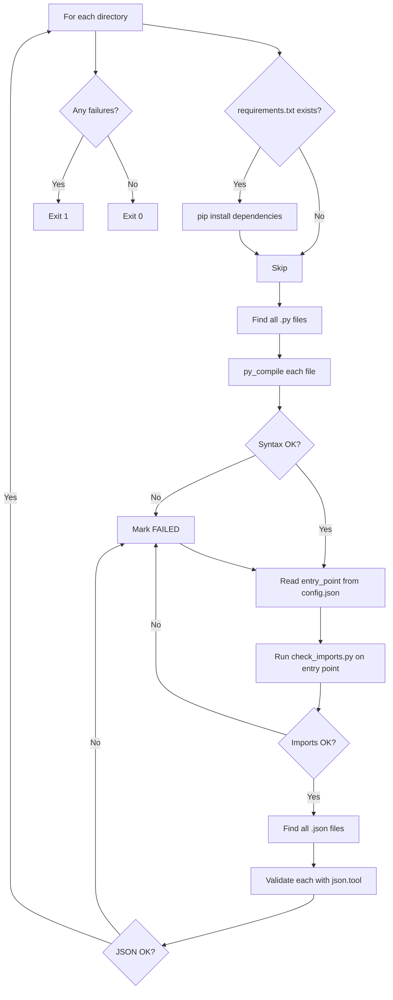

# check_code.py

Runs code quality checks on one or more integration directories.

## Overview

This script performs three sequential code quality checks on each given integration directory:

1. **Python syntax check** — uses `py_compile.compile()` directly to catch syntax errors
2. **Import availability check** — imports `check_imports()` as a function to verify modules exist
3. **JSON validity check** — uses `json.load()` directly to ensure all `.json` files are parseable

Before running checks, it installs the integration's dependencies from `requirements.txt` so that import checks can find third-party packages.

## Usage

```bash
python scripts/check_code.py <dir> [dir ...]
```

### Arguments

| Argument | Required | Description |
|----------|----------|-------------|
| `dir` | Yes (one or more) | Path to an integration directory to check |

### Exit Codes

| Code | Meaning |
|------|---------|
| `0`  | All checks passed for all directories |
| `1`  | One or more checks failed |
| `2`  | No directories provided (usage error) |

### Examples

```bash
# Check a single integration
python scripts/check_code.py my-integration

# Check multiple integrations
python scripts/check_code.py my-integration another-api

# Combine with get_changed_dirs.py
python scripts/check_code.py $(python scripts/get_changed_dirs.py origin/main)
```

## Checks Performed

### 1. Dependency Installation

```bash
pip install -r <dir>/requirements.txt -q
```

- Runs only if `requirements.txt` exists
- Uses `-q` (quiet) to reduce output noise
- Failures are silently ignored (`|| true`) to allow checks to continue

### 2. Python Syntax Check

```bash
python -m py_compile <file.py>
```

- Finds all `.py` files recursively in the directory using `find`
- Uses `py_compile` module to check syntax without executing code
- Reports each file with syntax errors individually
- Uses null-delimited file discovery (`find -print0`) to handle filenames with spaces

**On failure:**
```
🐍 Checking Python syntax...
   ❌ my-integration/broken_file.py

   Fix: Check the Python files above for syntax errors
   Run locally: python -m py_compile <file.py>
```

### 3. Import Availability Check

```bash
python scripts/check_imports.py <dir>/<entry_point>
```

- Reads `entry_point` from `config.json` to determine the main Python file
- Calls `check_imports()` directly as a function (see [check_imports.md](check_imports.md)) to verify all imports
- Skips gracefully if `config.json` or the entry point file doesn't exist

**On failure:**
```
📥 Checking imports...
   ❌ Import errors in my-integration/main.py

   Fix: Install missing packages in requirements.txt
   Or check if package name is spelled correctly
```

### 4. JSON Validity Check

```bash
python -m json.tool <file.json>
```

- Finds all `.json` files recursively in the directory
- Uses Python's built-in `json.tool` module to validate syntax
- Reports each invalid JSON file individually
- Uses null-delimited file discovery for safe filename handling

**On failure:**
```
📄 Checking JSON files...
   ❌ my-integration/config.json

   Fix: Check for missing commas, quotes, or brackets
   Validate at: https://jsonlint.com/
```

## How It Works



## Output Format

The script produces formatted output with emoji indicators for each check:

```
----------------------------------------
Checking: my-integration
----------------------------------------

📦 Installing dependencies...

🐍 Checking Python syntax...
   ✅ Syntax OK

📥 Checking imports...
   ✅ Imports OK

📄 Checking JSON files...
   ✅ JSON files OK

========================================
✅ CODE CHECK PASSED
========================================
```

## Dependencies

- **Python** — for `py_compile`, `json`, and `check_imports`
- **pip** — for installing integration dependencies
- **check_imports** — imported as a module for import validation

## Integration with CI

Called by the `validate-integration.yml` workflow (on pull requests):

```yaml
- name: Code Check
  if: steps.changed.outputs.dirs != ''
  run: python scripts/check_code.py ${{ steps.changed.outputs.dirs }}
```

Also exercised by the `self-test.yml` workflow against test examples in `tests/examples/` as a regression guard.
