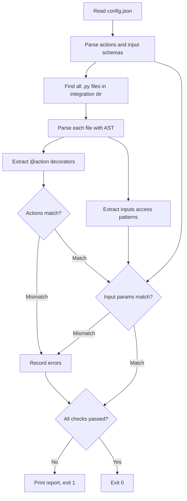

# check_config_sync.py

Config-code sync checker for Autohive integrations.

**Requires: Python 3.13+**

## Overview

This script validates that the `config.json` file and the integration's Python code are in sync. It scans all `.py` files in the integration directory (not just the entry point), supporting modular integrations where action handlers are split across multiple files. It uses AST (Abstract Syntax Tree) parsing to extract `@action` decorators and `inputs` access patterns from the code, then cross-validates them against the actions and input schemas declared in `config.json`.

Action mismatches always fail. Input-schema drift is treated as historic baggage for integrations that already existed at the provided base ref, so those cases warn only. For brand-new integrations, the same input drift fails validation when `--base-ref` is provided.

When `--base-ref` is provided, it must resolve to a local git commit from the integration directory's git repository. If the ref is missing because of a shallow checkout or an unfetched target branch, the script exits with code `2` instead of treating every integration as new. Renamed integration directories are detected with git rename detection for `config.json` and treated as existing integrations.

## Usage

```bash
python scripts/check_config_sync.py [--base-ref <ref>] <dir> [dir ...]
```

### Arguments

| Argument | Required | Description |
|----------|----------|-------------|
| `--base-ref` | No | Git ref used to decide whether each integration is new. Must resolve locally from the integration directory's git repository. If provided, input drift fails for integrations whose `config.json` did not exist at that ref and was not renamed from an existing path. |
| `dir` | Yes (one or more) | Path to an integration directory to check |

### Exit Codes

| Code | Meaning |
|------|---------|
| `0`  | Config and code are in sync, or only existing-integration input drift warnings were found |
| `1`  | One or more sync errors found, including input drift for a new integration when `--base-ref` is provided |
| `2`  | An error occurred during processing (missing files, parse error, usage error, unresolvable `--base-ref`) |

## Checks Performed

The script performs five checks:

### 1. Action Existence

Verifies that every action declared in `config.json` has a corresponding `@action`-decorated function in the code, and vice versa.

- **Config-only actions**: declared in `config.json` but no matching `@action` decorator in the code
- **Code-only actions**: decorated with `@action` in the code but not listed in `config.json`

### 2. Input Parameter Coverage

Checks that every input parameter defined in the `config.json` schema for an action is actually accessed in the corresponding function's code.

- Detects dead schema fields that are declared but never used
- Warns for existing integrations; fails for new integrations when `--base-ref` is provided

### 3. Code Parameter Coverage

Checks that every `inputs` key accessed in the code has a corresponding entry in the `config.json` schema.

- Detects undocumented parameters that are used in code but missing from the config
- Warns for existing integrations; fails for new integrations when `--base-ref` is provided

### 4. Required/Optional Consistency

Validates that the required/optional status of parameters in `config.json` matches how they are accessed in the code (e.g., parameters accessed with `.get()` or default values should be optional). These mismatches warn for existing integrations and fail for new integrations when `--base-ref` is provided.

### 5. Action Name Matching

Ensures that action names in `config.json` exactly match the decorator arguments or function names used in the code, catching typos and naming drift.

## How It Works



### Step-by-Step

1. **Read** `config.json` and extract declared actions and their input schemas
2. **Scan** all `.py` files in the integration directory (supporting modular layouts)
3. **Parse** each file into an Abstract Syntax Tree (no code execution)
4. **Extract** `@action` decorator names and `inputs` key access patterns from the AST
5. **Compare** actions between config and code — report any mismatches
6. **Compare** input parameters for each action — report undocumented, dead, or mismatched fields
7. **If `--base-ref` was provided**, resolve the integration's git repository root, verify the ref resolves there, then check whether the integration's `config.json` existed at that ref or was renamed from an existing path. Input drift is fatal for new integrations and warning-only for existing integrations.
8. **Report** all errors and warnings

## Output Format

```
🔗 Checking config-code sync...
   ✅ Config-code sync OK
```

On failure:

```
🔗 Checking config-code sync...
   ⚠️ Action 'send_email' in config.json but not found in code
   ❌ Input 'recipient' declared in config.json but never accessed in code
   ❌ Input 'priority' accessed in code but missing from config.json schema

   ❌ Config-code sync errors found

   Fix: Ensure config.json actions and input schemas match the code
   Run locally: python scripts/check_config_sync.py [--base-ref <ref>] <dir>
```

## Dependencies

- **Python 3.13+** — for `ast`, `json`, and `pathlib` standard library modules

No external dependencies are required. The script uses only Python's standard library.

## Integration with CI

This script is called by [`check_code.py`](check_code.md) as part of the code check. In CI, the composite action passes the PR base ref through `check_code.py` so new integrations fail on input drift while existing integrations continue to warn. It is also exercised independently by the `self-test.yml` workflow against test examples in `tests/examples/`.

```python
# Called internally by check_code.py:
from check_config_sync import check_config_sync
check_config_sync(str(dir_path), base_ref=base_ref)
```
