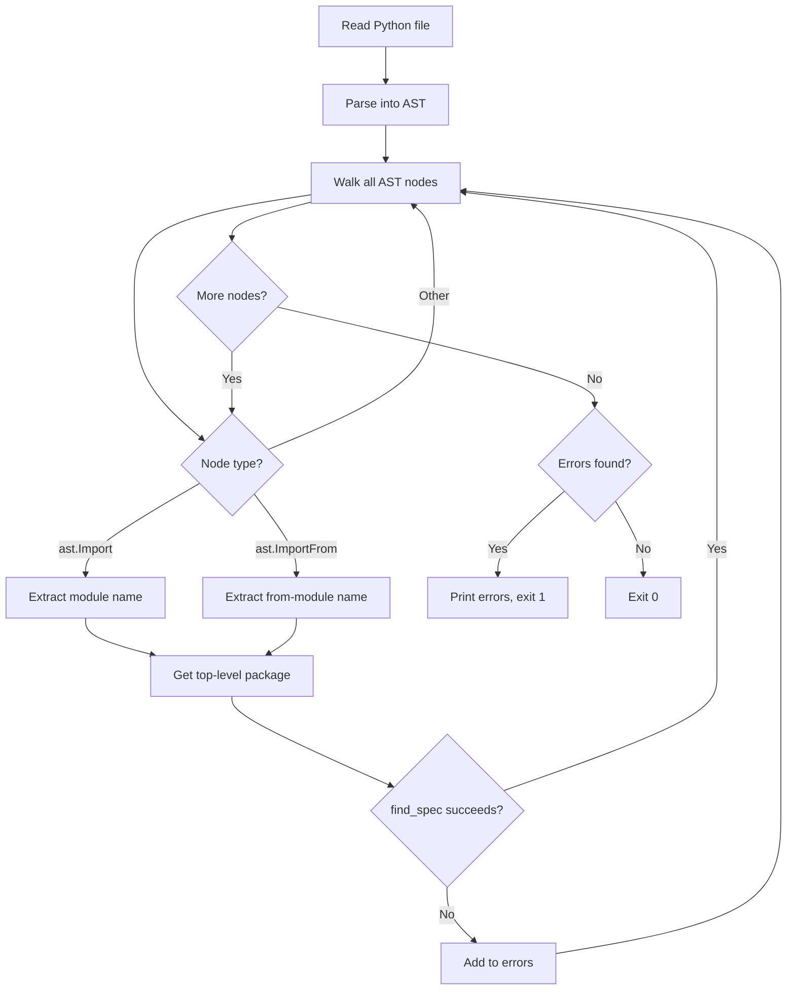

# check_imports.py

Import availability checker for Python files.

## Overview

This script validates that all imports in a Python file can be resolved in the current Python environment. It uses AST (Abstract Syntax Tree) parsing to extract import statements **without executing the code**, making it safe for untrusted files.

## Usage

```bash
python scripts/check_imports.py <file.py>
```

### Exit Codes

| Code | Meaning |
|------|---------|
| `0`  | All imports are available |
| `1`  | One or more imports are missing, or an error occurred |

### Examples

```bash
# Missing import detected
$ python scripts/check_imports.py my_integration/main.py
Missing module: some_unknown_package

# All imports available (no output)
$ python scripts/check_imports.py my_integration/main.py
```

## How It Works



### Step-by-Step

1. **Read** the Python source file
2. **Parse** it into an Abstract Syntax Tree (no code execution)
3. **Walk** the AST to find all `Import` and `ImportFrom` nodes
4. **Extract** the top-level module name from each import
5. **Check** if the module is available using `importlib.util.find_spec()`
6. **Report** any missing modules

## Supported Import Styles

| Import Statement | Module Checked |
|------------------|----------------|
| `import module` | `module` |
| `import module.submodule` | `module` (top-level only) |
| `from module import name` | `module` |
| `from pkg.sub import x` | `pkg` (top-level only) |

## Key Components

| Component | Purpose |
|-----------|---------|
| `ast.parse()` | Converts source code to an Abstract Syntax Tree without executing it (safe for untrusted code) |
| `ast.walk()` | Recursively traverses all nodes in the AST |
| `ast.Import` | Represents `import x` statements |
| `ast.ImportFrom` | Represents `from x import y` statements |
| `importlib.util.find_spec()` | Checks if a module can be located in the current Python environment |

## Limitations

- **Top-level only**: Only checks if the top-level package exists, not submodules (e.g., for `requests.auth`, only `requests` is verified)
- **Relative imports skipped**: Imports like `from . import x` are skipped because `node.module` is `None`
- **No name verification**: Does not verify that specific names exist within modules (e.g., `from os import nonexistent` would pass if `os` exists)

## Integration with CI

This script is called by the GitHub Actions workflow during the **Code Check** step:

```yaml
# From .github/workflows/validate-integration.yml
python scripts/check_imports.py "$dir/$ENTRY_POINT"
```

It runs after dependencies from `requirements.txt` are installed, ensuring that declared dependencies are actually available.
