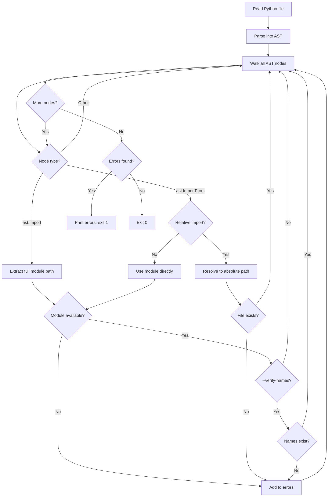

# check_imports.py

Import availability checker for Python files.

## Overview

This script validates that all imports in a Python file can be resolved in the current Python environment. It uses AST (Abstract Syntax Tree) parsing to extract import statements **without executing the code**, making it safe for untrusted files.

## Usage

```bash
python scripts/check_imports.py <file.py>
python scripts/check_imports.py --verify-names <file.py>
```

### Options

| Option | Description |
|--------|-------------|
| `--verify-names` | Verify that imported names exist within modules. **WARNING**: This imports modules and may execute code. |

### Exit Codes

| Code | Meaning |
|------|---------|
| `0`  | All imports are available |
| `1`  | One or more imports are missing |
| `2`  | An error occurred during processing (file not found, syntax error, usage error) |

### Examples

```bash
# Missing import detected
$ python scripts/check_imports.py my_integration/main.py
Missing module: some_unknown_package

# All imports available (no output)
$ python scripts/check_imports.py my_integration/main.py
```

## How It Works



### Step-by-Step

1. **Read** the Python source file
2. **Parse** it into an Abstract Syntax Tree (no code execution)
3. **Walk** the AST to find all `Import` and `ImportFrom` nodes
4. **Check imports**:
   - Absolute imports: verify full module path with `importlib.util.find_spec()`
   - Relative imports: resolve to absolute path and check file existence
5. **Verify names** (if `--verify-names`): import module and check `hasattr()`
6. **Report** any missing modules or names

## Supported Import Styles

| Import Statement | Module Checked |
|------------------|----------------|
| `import module` | `module` |
| `import module.submodule` | `module.submodule` (full path) |
| `from module import name` | `module` |
| `from pkg.sub import x` | `pkg.sub` (full path) |
| `from . import sibling` | Resolves to `pkg.sibling` and checks file exists |
| `from ..pkg import x` | Resolves to `parent.pkg` and checks file exists |

## Key Components

| Component | Purpose |
|-----------|---------|
| `ast.parse()` | Converts source code to an Abstract Syntax Tree without executing it (safe for untrusted code) |
| `ast.walk()` | Recursively traverses all nodes in the AST |
| `ast.Import` | Represents `import x` statements |
| `ast.ImportFrom` | Represents `from x import y` statements |
| `importlib.util.find_spec()` | Checks if a module can be located in the current Python environment |

## Name Verification (--verify-names)

By default, the script only checks if modules exist. With `--verify-names`, it also verifies that imported names exist within those modules.

```bash
# Without flag: passes (os module exists)
python scripts/check_imports.py file_with_bad_names.py

# With flag: fails (os.nonexistent doesn't exist)
python scripts/check_imports.py --verify-names file_with_bad_names.py
# Output: Missing name: os.nonexistent
```

### Security Warning

The `--verify-names` flag imports modules to check for name existence. This means **module-level code will be executed**. Only use with trusted code.

## Integration with CI

This script is called by the GitHub Actions workflow during the **Code Check** step:

```yaml
# From .github/workflows/validate-integration.yml
python scripts/check_imports.py "$dir/$ENTRY_POINT"
```

It runs after dependencies from `requirements.txt` are installed, ensuring that declared dependencies are actually available.
