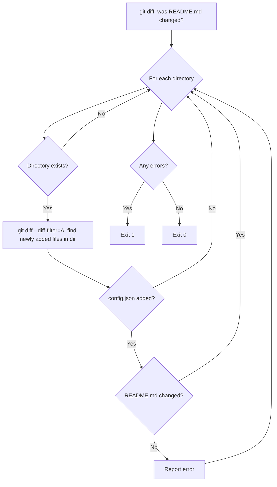

# check_readme.py

Verifies that the main `README.md` is updated when new integrations are added.

## Overview

When a new integration is added to the repository, the main `README.md` must also be updated to include the new integration in the integrations table. This script detects whether a new `config.json` has been added within an integration directory (indicating a brand-new integration) and checks whether `README.md` was also modified in the same changeset.

This check only makes sense in the context of a pull request, where there is a clear base ref to compare against.

## Usage

```bash
python scripts/check_readme.py <base_ref> <dir> [dir ...]
```

### Arguments

| Argument | Required | Description |
|----------|----------|-------------|
| `base_ref` | Yes | Git ref to diff against (e.g., `origin/main`) |
| `dir` | Yes (one or more) | Integration directories to check |

### Exit Codes

| Code | Meaning |
|------|---------|
| `0`  | README is up to date, or no new integrations were detected |
| `1`  | New integration files detected but README.md was not updated |
| `2`  | An error occurred (invalid git ref, missing arguments) |

### Examples

```bash
# Check a single integration against main
python scripts/check_readme.py origin/main my-new-integration

# Check multiple integrations
python scripts/check_readme.py origin/main integration-a integration-b

# Combine with get_changed_dirs.py
python scripts/check_readme.py origin/main $(python scripts/get_changed_dirs.py origin/main)
```

## How It Works



### Step-by-Step

1. Check if `README.md` (at the repository root) was modified between `base_ref` and `HEAD`
2. For each given integration directory:
   a. Skip if the directory doesn't exist
   b. Check if any files were **newly added** (`--diff-filter=A`) within that directory
   c. If `config.json` was newly added (i.e. it's a brand-new integration) **and** `README.md` was **not** changed → report an error
3. Exit with code 1 if any errors were found, 0 otherwise

### Key Git Commands

| Command | Purpose |
|---------|---------|
| `git diff --name-only <base> HEAD \| grep "^README\.md$"` | Check if root README.md was modified |
| `git diff --name-only --diff-filter=A <base> HEAD \| grep "^<dir>/"` | Find newly added files in a specific directory |

The `--diff-filter=A` flag is important: it only shows **A**dded files, not modified ones. Within those added files, the script specifically looks for `config.json` — its presence signals a brand-new integration. This means adding new files to an existing integration (e.g. unit test files) does not trigger the check.

## Output Format

### When README was not updated:

```
❌ NEW INTEGRATION DETECTED: 'my-new-api'

   But main README.md was NOT updated!

   Fix: Add your integration to the main README.md file
   Example:
   | my-new-api | Your description | Auth Type |

========================================
❌ README CHECK FAILED
========================================
```

### When all is well:

```
========================================
✅ README CHECK PASSED
========================================
```

## Edge Cases

| Scenario | Behavior |
|----------|----------|
| Only existing files modified in integration dir | ✅ Passes (no new files detected) |
| New files added to existing integration (e.g. test files) | ✅ Passes (no `config.json` added) |
| New integration added and README.md updated | ✅ Passes |
| New integration added but README.md NOT updated | ❌ Fails |
| Directory argument doesn't exist on disk | Skipped silently |
| No arguments provided | Exits with code 2 (usage error) |

## Integration with CI

Called by the `validate-integration.yml` workflow, **only during pull requests**:

```yaml
- name: README Check
  if: steps.changed.outputs.dirs != ''
  run: python scripts/check_readme.py "origin/${{ github.base_ref }}" ${{ steps.changed.outputs.dirs }}
```

This check is skipped on direct pushes since there is no meaningful base ref to compare against for README changes.
