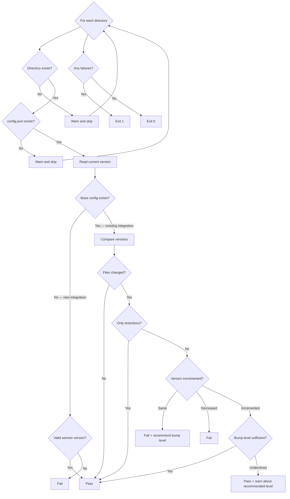

# check_version_bump.py

Verifies that integration versions are incremented when changes are made, and recommends the appropriate bump level.

## Overview

When an integration is modified in a pull request, its `version` field in `config.json` must be incremented. This script compares the current version against the base ref to detect missing bumps, and uses heuristics based on config and code changes to recommend major, minor, or patch.

For new integrations (no `config.json` on the base ref), it simply checks that a valid semver version exists.

This check only makes sense in the context of a pull request, where there is a clear base ref to compare against.

## Usage

```bash
python scripts/check_version_bump.py <base_ref> <dir> [dir ...]
```

### Arguments

| Argument | Required | Description |
|----------|----------|-------------|
| `base_ref` | Yes | Git ref to diff against (e.g., `origin/master`) |
| `dir` | Yes (one or more) | Integration directories to check |

### Exit Codes

| Code | Meaning |
|------|---------|
| `0`  | All versions are correctly bumped (or no changes detected) |
| `1`  | Version bump missing or version not incremented |
| `2`  | An error occurred (invalid git ref, missing arguments) |

### Examples

```bash
# Check a single integration against master
python scripts/check_version_bump.py origin/master my-integration

# Check multiple integrations
python scripts/check_version_bump.py origin/master integration-a integration-b

# Combine with get_changed_dirs.py
python scripts/check_version_bump.py origin/master $(python scripts/get_changed_dirs.py origin/master)
```

## How It Works



### Step-by-Step

1. For each given integration directory:
   a. Skip with a warning if the directory or `config.json` doesn't exist
   b. Read the current `version` from `config.json`
   c. Retrieve the base version via `git show <base_ref>:<dir>/config.json`
   d. If no base config exists → new integration; just verify a valid semver version is present
   e. If files changed but version is unchanged → fail with a recommended bump level
   f. If version decreased or stayed the same → fail
   g. If version incremented but the bump level is lower than recommended → pass with a warning
2. Exit with code 1 if any failures, 0 otherwise

### Key Git Commands

| Command | Purpose |
|---------|---------|
| `git show <base>:<dir>/config.json` | Retrieve the config.json from the base ref |
| `git diff --name-only <base> HEAD -- <dir>/` | List changed files within the directory |
| `git diff --name-only --diff-filter=A <base> HEAD -- <dir>/` | Find newly added files |
| `git diff --name-only --diff-filter=D <base> HEAD -- <dir>/` | Find deleted files |
| `git diff -U0 <base> HEAD -- <dir>/*.py <dir>/**/*.py` | Get line-level diff of Python files for symbol analysis |

## Bump Recommendation Heuristic

The script recommends a bump level by inspecting both config.json changes and code diffs. Checks are evaluated in order; the first match wins.

### Config-level signals

| Signal | Recommended Bump |
|--------|-----------------|
| `auth` object changed (type, scopes, fields) | **major** |
| `entry_point` changed | **major** |
| Actions removed from `actions` | **major** |
| New actions added to `actions` | **minor** |
| Existing action schemas changed (description, input_schema, etc.) | **minor** |

### Code-level signals (from `git diff`)

| Signal | Recommended Bump |
|--------|-----------------|
| `.py` source files deleted (excluding tests) | **major** |
| `class` or `def` definitions removed | **major** |
| New `.py` source files added (excluding tests) | **minor** |
| New `class` or `def` definitions added | **minor** |

### Test/doc-only changes

If every changed file is in `tests/`, a `.md` file, or `requirements.txt` (and the config is unchanged), the version check is **skipped entirely** — no bump is required. This allows adding or updating tests, docs, and dependencies without touching the version number.

### Fallback

If none of the above signals match, the recommendation defaults to **patch** (bug fixes, docs, dependency updates, test changes).

The recommendation is advisory — bumping at a lower level than recommended produces a ⚠️ warning but does not fail the check. Only a missing or non-incremented version fails.

## Output Format

### When version is not bumped:

```
❌ my-integration: Version not incremented (1.0.0 → 1.0.0)

   Recommended: 1.0.0 → 1.1.0 (minor bump)
   Reason: new features detected (new actions, schema changes, or new functions/classes)

   Changed files:
     - my-integration/my_integration.py
     - my-integration/actions/new_action.py
     - my-integration/config.json

========================================
❌ VERSION CHECK FAILED
========================================
```

### When version is bumped correctly:

```
✅ my-integration: 1.0.0 → 1.0.1 (patch bump)

========================================
✅ VERSION CHECK PASSED
========================================
```

### When version is bumped but undershooting:

```
✅ my-integration: 1.0.0 → 1.0.1 (patch bump) (⚠️ consider a minor bump — new features detected (new functions, classes, or actions))

========================================
✅ VERSION CHECK PASSED
========================================
```

### When only tests/docs changed (no bump needed):

```
✅ my-integration: No version bump needed (only tests/docs changed)

========================================
✅ VERSION CHECK PASSED
========================================
```

### New integration with valid version:

```
✅ my-integration: New integration with version 1.0.0

========================================
✅ VERSION CHECK PASSED
========================================
```

### New integration missing version:

```
❌ my-integration: New integration must have a valid semver 'version' in config.json (e.g. "1.0.0")

========================================
❌ VERSION CHECK FAILED
========================================
```

## Edge Cases

| Scenario | Behavior |
|----------|----------|
| New integration with valid semver version | ✅ Passes |
| New integration without version field | ❌ Fails |
| Files changed and version incremented | ✅ Passes |
| Files changed but version unchanged | ❌ Fails with recommendation |
| Version decreased | ❌ Fails |
| Bump level lower than recommended | ✅ Passes with ⚠️ warning |
| Only test/doc files changed, version unchanged | ✅ Passes (no bump needed) |
| No files changed in directory | ✅ Passes (nothing to check) |
| Directory doesn't exist on disk | ⚠️ Skipped with warning |
| No `config.json` in directory | ⚠️ Skipped with warning |
| Base ref has no valid version | ✅ Passes (any valid version is accepted) |
| No arguments provided | Exits with code 2 (usage error) |

## Integration with CI

Called by the composite action in `action.yml`, **only during pull requests** when `base_ref` is provided:

```yaml
- name: Version Check
  if: steps.detect.outputs.dirs != '' && inputs.base_ref != ''
  run: python scripts/check_version_bump.py "${{ inputs.base_ref }}" ${{ steps.detect.outputs.dirs }}
```

This check is skipped when `base_ref` is not provided (e.g., when directories are specified manually without a base ref) since there is no base version to compare against.
