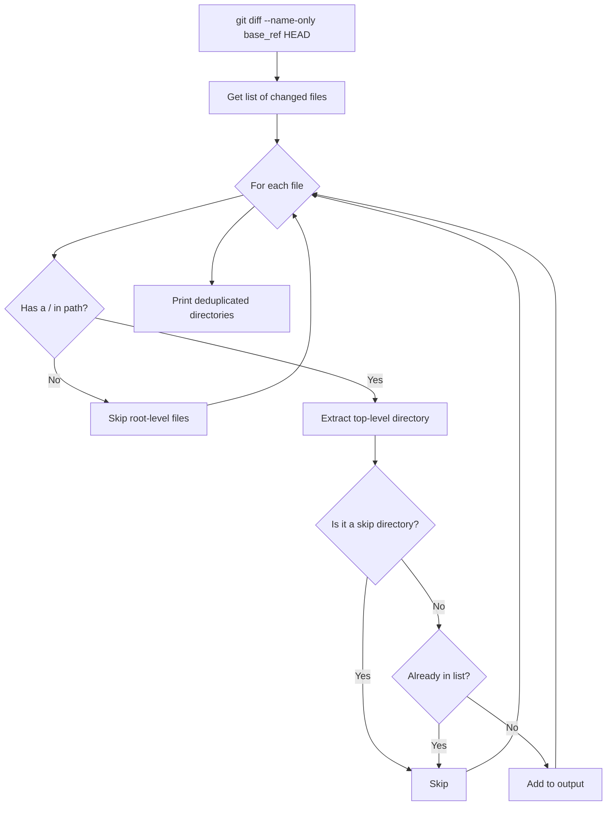

# get_changed_dirs.py

Requires: Python 3.12+

Detects which integration directories have changed between two git refs.

## Overview

This script compares the current `HEAD` against a given base git ref using `git diff`, extracts the top-level directories from changed file paths, and filters out infrastructure directories. The result is a space-separated list of integration directory names that can be passed to other validation scripts.

This is the **first step** in the CI validation pipeline — it determines _which_ integrations need to be validated.

## Usage

```bash
python scripts/get_changed_dirs.py <base_ref>
```

### Arguments

| Argument | Required | Description |
|----------|----------|-------------|
| `base_ref` | Yes | Git ref to diff against (e.g., `origin/main`, `HEAD~1`, a commit SHA) |

### Exit Codes

| Code | Meaning |
|------|---------|
| `0`  | Success (outputs directory names, or empty string if no integration dirs changed) |
| `2`  | An error occurred (invalid git ref, missing arguments) |

### Output

Space-separated list of changed integration directory names, printed to stdout. Empty output (no text) means no integration directories were changed.

### Examples

```bash
# Check what changed in the last commit
python scripts/get_changed_dirs.py HEAD~1

# Check what changed compared to main (typical PR scenario)
python scripts/get_changed_dirs.py origin/main

# Check changes across the last 5 commits
python scripts/get_changed_dirs.py HEAD~5
```

#### Example Output

If the following files changed:
```
my-integration/config.json
my-integration/main.py
another-api/README.md
scripts/check_imports.py
README.md
```

The script would output:
```
my-integration another-api
```

## How It Works



### Step-by-Step

1. Run `git diff --name-only` between `base_ref` and `HEAD` to get changed files
2. For each changed file, extract the top-level directory (first path component)
3. Skip root-level files (files without a `/` in their path, e.g., `README.md`)
4. Skip infrastructure directories (`.github`, `scripts`, `tests`, `template-structure`)
5. Deduplicate directory names
6. Output the final space-separated list

## Skipped Directories

The following directories are excluded from the output because they are infrastructure, not integrations:

| Directory | Reason |
|-----------|--------|
| `.github` | GitHub Actions workflows and configuration |
| `scripts` | Validation tooling scripts |
| `tests` | Test examples and fixtures |
| `template-structure` | Integration template files |

## Integration with CI

This script is called in the `validate-integration.yml` workflow (on pull requests) to determine which integrations need validation:

```yaml
- name: Get changed integration folders
  id: changed
  run: |
    DIRS=$(python scripts/get_changed_dirs.py "origin/${{ github.base_ref }}")
    echo "dirs=$DIRS" >> $GITHUB_OUTPUT
```

The output is stored as a GitHub Actions step output and used by subsequent steps to conditionally run validation only on changed integrations.
