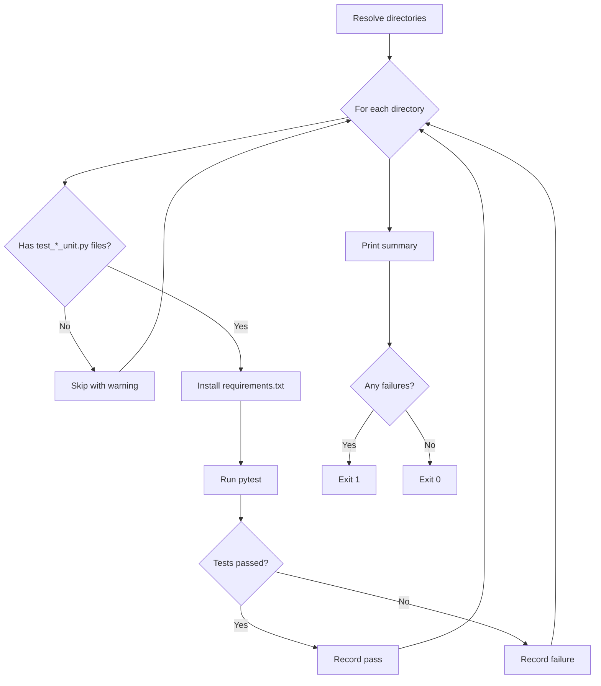

# run_tests.py

Discovers and runs unit tests for integration directories, installing each integration's own dependencies first.

## Overview

Each integration pins its own SDK version in `requirements.txt`. The test runner installs dependencies and runs pytest **per-integration** to ensure each integration is tested against its own pinned SDK version.

Integrations without `test_*_unit.py` files are skipped with a warning — they do not cause a failure.

## Usage

```bash
python scripts/run_tests.py [dir ...]
```

### Arguments

| Argument | Required | Description |
|----------|----------|-------------|
| `dir` | No (zero or more) | Integration directories to test. If omitted, auto-discovers all directories with a `config.json` |

### Exit Codes

| Code | Meaning |
|------|---------|
| `0`  | All tests passed (or no tests found) |
| `1`  | One or more test failures |
| `2`  | An error occurred (directory not found) |

### Examples

```bash
# Run tests for a single integration
python scripts/run_tests.py hackernews

# Run tests for multiple integrations
python scripts/run_tests.py hackernews bitly notion

# Auto-discover and run all integrations with unit tests
python scripts/run_tests.py
```

## How It Works



### Step-by-Step

1. Resolve integration directories from CLI args or auto-detect (subdirectories with `config.json`)
2. For each directory, check for `test_*_unit.py` files in `tests/`
3. Skip directories without unit tests (warn but don't fail)
4. For each testable integration:
   a. Install the integration's `requirements.txt` (includes its pinned SDK version)
   b. Run pytest with `--import-mode=importlib`, `-m unit`, coverage enabled
   c. Record pass or failure
5. Print summary of passed/failed integrations
6. Exit 0 if all passed, 1 if any failed

### Per-Integration Isolation

Different integrations may pin different SDK versions. For example:

- `bitly/requirements.txt` → `autohive-integrations-sdk~=1.0.2`
- `notion/requirements.txt` → `autohive-integrations-sdk~=2.0.0`

The test runner handles this by installing dependencies and running pytest separately for each integration. The last `pip install` overwrites the previous SDK version, which is why pytest must run immediately after each install.

### Test Discovery

Unit test files must follow the naming convention `test_*_unit.py` and be located in the integration's `tests/` directory:

```
my-integration/
  tests/
    test_my_integration_unit.py   ← discovered
    test_my_integration.py        ← NOT discovered (legacy manual test)
    conftest.py                   ← loaded by pytest automatically
```

## Output Format

### Tests found and passing:

```
🧪 Running unit tests for: hackernews, bitly
============================================================
  hackernews
============================================================
... pytest output ...

============================================================
  bitly
============================================================
... pytest output ...

============================================================
✅ Tests passed: hackernews, bitly
============================================================
```

### Some tests failing:

```
============================================================
✅ Tests passed: hackernews
❌ Tests failed: bitly
============================================================
```

### No unit tests found:

```
⚠️  No unit tests (test_*_unit.py) found in: my-integration
⚠️  No unit tests to run
```

## Unit Tests Only

This script only runs **unit tests** (`test_*_unit.py`). Integration tests (`test_*_integration.py`) are a separate concern:

- They require real API credentials and must never run in CI.
- They are not auto-discovered by pytest (`python_files` restricts discovery to `test_*_unit.py`).
- Developers run them locally by passing the file path explicitly: `pytest <integration>/tests/test_*_integration.py -m integration`

See the integrations repo's `CONTRIBUTING.md` for full details on running both test types.

## Integration with CI

Called by the composite action in `action.yml`:

```yaml
- name: Tests
  if: steps.detect.outputs.dirs != ''
  run: python scripts/run_tests.py ${{ steps.detect.outputs.dirs }}
```

The test infrastructure (`pyproject.toml`, `conftest.py`, `requirements-test.txt`) lives in the integrations repo — see its `CONTRIBUTING.md` for how to write and run tests locally.
