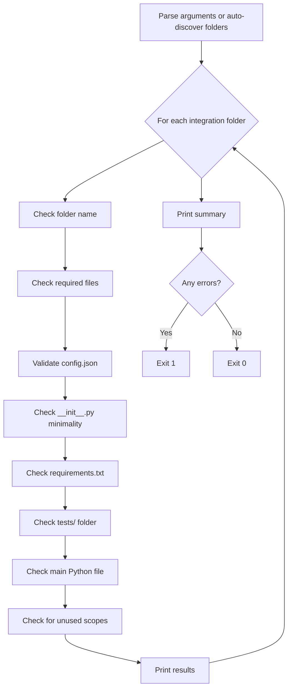

# validate_integration.py

Integration structure and configuration validator.

**Requires: Python 3.13+**

## Overview

This script validates that integration directories follow the required folder structure, naming conventions, and configuration schema. It checks for required files, validates `config.json` structure and content, verifies auth configuration, inspects action definitions, and detects potentially unused OAuth scopes.

This is the most comprehensive validation tool in the tooling suite, covering structural and configuration correctness rather than code quality (which is handled by `check_code.sh`).

## Usage

```bash
# Validate specific integrations
python scripts/validate_integration.py <dir> [dir ...]

# Validate all integrations (auto-discovers integration folders at repo root)
python scripts/validate_integration.py
```

### Arguments

| Argument | Required | Description |
|----------|----------|-------------|
| `dir` | No | One or more integration directories to validate. If omitted, auto-discovers all integration folders at the repository root. |

### Exit Codes

| Code | Meaning |
|------|---------|
| `0`  | All validations passed (possibly with warnings) |
| `1`  | One or more validation errors found |

### Examples

```bash
# Validate a single integration
python scripts/validate_integration.py my-integration

# Validate multiple integrations
python scripts/validate_integration.py my-integration another-api

# Validate all integrations in the repo
python scripts/validate_integration.py

# Combine with get_changed_dirs.sh
python scripts/validate_integration.py $(scripts/get_changed_dirs.sh origin/main)
```

## Validations Performed

The validator runs 8 checks in sequence for each integration directory:

### 1. Folder Name (`_check_folder_name`)

| Check | Severity | Description |
|-------|----------|-------------|
| Lowercase | Error | Folder name must be all lowercase |
| No spaces | Error | Folder name cannot contain spaces |
| Valid characters | Warning | Should only contain `a-z`, `0-9`, and `-` |

```
✅ my-integration       (correct)
✅ shopify-admin         (correct)
❌ My-Integration        (uppercase)
❌ my integration        (spaces)
⚠️ my_integration        (underscores - warning only)
```

### 2. Required Files (`_check_required_files`)

Checks that all mandatory files exist in the integration directory:

| File | Severity | Description |
|------|----------|-------------|
| `config.json` | Error | Integration configuration |
| `__init__.py` | Error | Python package init |
| `requirements.txt` | Error | Python dependencies |
| `README.md` | Error | Integration documentation |
| `icon.png` or `icon.svg` | Error | Integration icon (either format accepted) |

### 3. config.json Validation (`_check_config_json`)

#### Required Fields

| Field | Type | Description |
|-------|------|-------------|
| `name` | string | Must match folder name (case-insensitive, `-` and `_` normalized) |
| `version` | string | Semantic version format (`x.y.z`) |
| `description` | string | Clear description of the integration |
| `entry_point` | string | Main Python file (must exist on disk) |
| `actions` | object | At least one action must be defined |

#### Auth Configuration (`_validate_auth_config`)

Validates based on `auth.type`:

| Auth Type | Required Fields | Description |
|-----------|----------------|-------------|
| `platform` | `provider`, `scopes` (array) | OAuth2-based authentication |
| `custom` | `fields.properties` | API key or token-based authentication |
| _(omitted)_ | — | No authentication (public APIs) |

#### Action Configuration (`_validate_actions_config`)

For each action defined in `config.json`:

| Check | Severity | Description |
|-------|----------|-------------|
| Action key is lowercase | Warning | Should be `snake_case` |
| `display_name` present | Warning | Human-readable name |
| `description` present | Warning | What the action does |
| `input_schema` present | Warning | JSON Schema for input |
| `output_schema` present | Warning | JSON Schema for output |

### 4. \_\_init\_\_.py Minimality (`_check_init_py`)

Verifies that `__init__.py` contains only import and `__all__` statements:

```python
# ✅ Correct
from .my_integration import my_integration
__all__ = ["my_integration"]

# ❌ Too much code
from .my_integration import my_integration
import logging
logger = logging.getLogger(__name__)
__all__ = ["my_integration"]
```

Allowed patterns:
- `from .module import name`
- `__all__ = [...]`

### 5. requirements.txt Check (`_check_requirements_txt`)

| Check | Severity | Description |
|-------|----------|-------------|
| `autohive-integrations-sdk` present | Error | SDK dependency is mandatory |
| Version pinned (`~=1.0` or `==`) | Warning | Should pin SDK version |

### 6. Tests Folder (`_check_tests_folder`)

| Check | Severity | Description |
|-------|----------|-------------|
| `tests/` directory exists | Error | Test directory required |
| `tests/__init__.py` exists | Error | Test package init |
| `tests/context.py` exists | Error | Test import setup |
| `tests/test_*.py` exists | Error | At least one test file |

### 7. Main Python File (`_check_main_python_file`)

Inspects the entry point file for expected patterns:

| Check | Severity | Description |
|-------|----------|-------------|
| `Integration` imported | Warning | Should import from SDK |
| `ActionHandler` imported | Warning | Should import from SDK |
| `Integration.load()` called | Warning | Standard loading pattern |
| `@integration.action("name")` decorators | Warning | Each config action should have a matching decorator |

### 8. Unused Scopes Detection (`_check_unused_scopes`)

For integrations using platform (OAuth2) authentication, the validator uses a heuristic to detect scopes that may not be needed:

1. Extract keywords from each scope (e.g., `read:sites` → `["read", "sites"]`)
2. Collect text from all action names, descriptions, and display names
3. Check if meaningful keywords (length > 3, not generic like `read`/`write`) appear in action text
4. Report scopes with no keyword matches as potentially unused

This is a **heuristic check** and may produce false positives — the warning asks the developer to verify manually.

## How It Works



## Auto-Discovery

When no arguments are provided, the script auto-discovers integration folders at the repository root by:

1. Iterating all directories in the repository root
2. Skipping known infrastructure directories (`.github`, `.git`, `scripts`, `tests`, `template-structure`, `__pycache__`, `.vscode`, `.idea`, `node_modules`)
3. Skipping hidden directories (starting with `.`)
4. Including directories that contain `config.json` or any `.py` file

## Output Format

### Per-Integration Output

```
============================================================
Integration: my-integration
============================================================

Errors (2):
  ❌ Missing required file: icon.png or icon.svg (Integration icon)
  ❌ requirements.txt must include 'autohive-integrations-sdk'

Warnings (1):
  ⚠️ Version should follow semantic versioning (x.y.z): '1.0'
```

### Summary Output

```
============================================================
SUMMARY
============================================================
Integrations validated: 3
Total errors: 2
Total warnings: 1

❌ Validation FAILED - please fix errors before submitting PR
```

## Error vs Warning

| Severity | Effect | When Used |
|----------|--------|-----------|
| **Error** | Fails validation (exit 1) | Missing required files, invalid config structure, missing SDK dependency |
| **Warning** | Passes validation (exit 0) | Style issues, missing optional fields, potential unused scopes |

## Integration with CI

Called by the `validate-integration.yml` workflow (on pull requests) as the **Structure Check** step:

```yaml
- name: Structure Check
  if: steps.changed.outputs.dirs != ''
  run: python scripts/validate_integration.py ${{ steps.changed.outputs.dirs }}
```

The script is also exercised by the `self-test.yml` workflow, which runs it against the test examples in `tests/examples/` as a regression guard whenever `scripts/` or `tests/` change.
